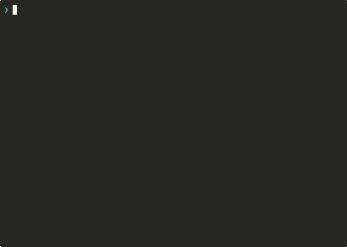
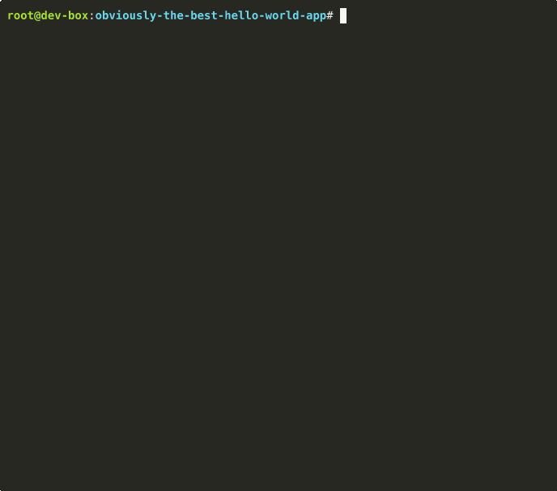

# dev-infra

An AI-first development environment for solo developers. Run multiple AI coding agents (Claude, Gemini) in parallel across tmux sessions, with all the infrastructure you need to ship — database, cache, object storage, email, reverse proxy, and monitoring. One `./install.sh` on any Ubuntu/Debian host.

## Prerequisites

- A running **Ubuntu/Debian machine** with root access. This repo does not cover provisioning or setting up the host itself.
- An **SSH key** on your local machine (Mac/Linux).

## Architecture

```
  Mac (Client)
  ┌────────────────────────────────────────────────┐
  │  iTerm2 panes: t1, t2, t3, t4, t5             │
  └──────┬─────┬─────┬─────┬─────┬────────────────┘
         │ SSH │     │     │     │
         ▼     ▼     ▼     ▼     ▼

  Host (Ubuntu/Debian)
  ┌────────────────────────────────────────────────┐
  │                                                │
  │  dev-box (host network, :2222)                 │
  │  ┌──────────────────────────────────────────┐  │
  │  │  zsh + tmux + oh-my-zsh                  │  │
  │  │  claude / gemini CLI                     │  │
  │  │  git worktrees                           │  │
  │  │  VS Code tunnel                          │  │
  │  │  docker CLI ──► host docker.sock (DooD)  │  │
  │  └──────────────────────────────────────────┘  │
  │                                                │
  │  Services (Docker Compose)                     │
  │  ┌─────────────────┐  ┌─────────────────┐      │
  │  │ timescaledb      │  │ redis            │      │
  │  │ :5432            │  │ :6379            │      │
  │  ├─────────────────┤  ├─────────────────┤      │
  │  │ traefik          │  │ minio            │      │
  │  │ :80 / :8080      │  │ :9000 / :9001    │      │
  │  ├─────────────────┤  ├─────────────────┤      │
  │  │ mailpit          │  │ adminer          │      │
  │  │ :8025 / :1025    │  │ :8081            │      │
  │  ├─────────────────┤  ├─────────────────┤      │
  │  │ homepage         │  │ dozzle           │      │
  │  │ :3000            │  │ :9999            │      │
  │  ├─────────────────┤  ├─────────────────┤      │
  │  │ uptime-kuma      │  │ watchtower       │      │
  │  │ :3001            │  │ (no port)        │      │
  │  └─────────────────┘  └─────────────────┘      │
  └────────────────────────────────────────────────┘
```

### Why DooD (Docker-outside-of-Docker)?

The dev-box runs Docker commands by mounting the host's `/var/run/docker.sock`. Containers launched from inside dev-box are **siblings** on the host, not nested children.

| | DooD (this setup) | DinD (docker-in-docker) |
|-|---|---|
| **Performance** | Native — no nested overhead | Extra virtualization layer |
| **Port access** | `localhost` just works (host networking) | Nested network, extra port mapping |
| **Volume mounts** | Paths must be host paths | Relative to inner daemon |
| **Image cache** | Shared with host | Separate cache per instance |
| **Security** | Socket = root on host (fine for personal dev) | More isolated but slower |

**TL;DR**: DooD is simpler and faster for a single-dev setup. DinD is better for CI runners or multi-tenant isolation.

## 1. Install

```bash
# Generate an SSH key if you don't have one
[ -f ~/.ssh/id_ed25519 ] || ssh-keygen -t ed25519

# Copy your key to the host
ssh-copy-id root@<host-ip>

# Install on the host
ssh root@<host-ip>
git clone https://github.com/brianwu02/dev-infra.git
cd dev-infra
sudo ./install.sh
```

> If `ssh-copy-id` fails (host has password auth disabled), manually append your key:
> ```bash
> cat ~/.ssh/id_ed25519.pub | ssh root@<host-ip> "mkdir -p ~/.ssh && cat >> ~/.ssh/authorized_keys"
> ```

The installer will: install Docker if needed, generate a `.env` with a random DB password, copy your SSH keys into the dev-box, and start all services.

## 2. Connect

The dev-box is your development environment. The host just runs Docker — you don't work on it directly.

### Terminal (SSH)

```bash
ssh -p 2222 root@<host-ip>
```

The dev-box only accepts SSH key auth (no passwords). The installer copies keys from the host's `~/.ssh/authorized_keys` automatically — if you can SSH into the host, you can SSH into the dev-box.

### VS Code

**Option A: Remote SSH** (recommended)

1. Install the [Remote - SSH](https://marketplace.visualstudio.com/items?itemName=ms-vscode-remote.remote-ssh) extension
2. Add to `~/.ssh/config` on your Mac:
   ```
   Host devbox
     HostName <host-ip>
     Port 2222
     User root
   ```
3. `Cmd+Shift+P` → "Remote-SSH: Connect to Host" → select `devbox`
4. Open `/workspace` as your folder

**Option B: VS Code Tunnel** (works from any browser, no SSH config needed)

```bash
# Inside the dev-box
code tunnel
```

Follow the GitHub auth prompts. Then connect via `vscode.dev` or the VS Code desktop app using the [Remote Tunnels](https://marketplace.visualstudio.com/items?itemName=ms-vscode.remote-server) extension.

### Remote Access (Tailscale)

Want to code from a coffee shop? [Tailscale](https://tailscale.com/) creates a private WireGuard mesh network so your Mac can reach your dev box from anywhere — no port forwarding, no exposing SSH to the internet.

```bash
# On the host
curl -fsSL https://tailscale.com/install.sh | sh
sudo tailscale up

# On your Mac
brew install tailscale
# Open Tailscale app, sign in with the same account
```

Once both devices are on your tailnet, use the Tailscale IP instead of your LAN IP:

```bash
ssh -p 2222 root@<tailscale-ip>
```

Update your `~/.ssh/config` accordingly:

```
Host devbox
  HostName <tailscale-ip>   # e.g. 100.x.y.z
  Port 2222
  User root
```

All services (Adminer, Mailpit, MinIO console, etc.) are accessible at `http://<tailscale-ip>:<port>` — same as on your home network, but encrypted and works from anywhere. Free for personal use.

## 3. Verify

Once connected to the dev-box, verify the full stack works with the included example app — a FastAPI server with an HTML page that increments a hit counter stored in TimescaleDB.

```bash
# Start TimescaleDB and the example app
cd /workspace/.dev-infra
docker compose up -d timescaledb obviously-the-best-hello-world-app

# Open in your browser (use your host's IP)
# http://<host-ip>:8000
```

You'll see a counter with **Hit** and **Reset** buttons. Every click writes to TimescaleDB — the count persists across container restarts.

There's also a JSON API:

```bash
curl http://localhost:8000/api              # read counter
curl -X POST http://localhost:8000/api/hit   # increment
curl -X POST http://localhost:8000/api/reset # reset to zero
```

When you're done:

```bash
docker compose stop obviously-the-best-hello-world-app
```

## 4. Start Building

All your projects live in `/workspace`. Clone repos here — this is your working directory.

```bash
cd /workspace
git clone <your-repo>
cd your-project
```

> **Path mapping:** `/workspace/myproject` inside the dev-box is actually `/home/docker/projects/myproject` on the host. When mounting volumes in docker commands from inside the dev-box, use host paths. The host filesystem is available at `/host_root/` for reference.

## 5. Workflows

The multi-terminal workflow is inspired by [Boris Cherny's AI terminal setup](https://youtu.be/julbw1JuAz0?si=Evag9oEPUgDUOWiK&t=2017), where he describes running multiple AI agents in parallel across tmux sessions.

### Multi-Terminal (tmux + SSH)



Add to `~/.zshrc` or `~/.bashrc` on your Mac. Requires `fzf` (`brew install fzf`) and a `devbox` entry in `~/.ssh/config` (see [Connect](#2-connect)).

```bash
# ts — tmux session manager for the dev-box
#
# Usage:
#   ts                  Interactive picker (fzf) — list existing sessions or create new
#   ts my-feature       Jump straight into session "my-feature" (creates if needed)
#
# Sessions persist on the dev-box. Disconnect (close terminal, lose wifi)
# and reattach later — everything is exactly where you left it.
ts() {
  if [ -n "$1" ]; then
    echo "Connecting to session: $1..."
    ssh devbox -t "tmux new-session -A -s \"$1\""
    return 0
  fi

  echo "Fetching sessions from dev-box..."
  local sessions=$(ssh devbox "tmux ls -F '#{session_name}' 2>/dev/null")

  local menu_items
  if [ -z "$sessions" ]; then
    menu_items="[Create New Session]"
  else
    menu_items=$(printf "[Create New Session]\n%s" "$sessions")
  fi

  local selected=$(echo "$menu_items" | fzf --prompt="Dev-Box Tmux > " --height=40% --layout=reverse --border --cycle)

  if [ "$selected" = "[Create New Session]" ]; then
    printf "Enter a name for the new session: "
    read new_name </dev/tty
    if [ -n "$new_name" ]; then
      ssh devbox -t "tmux new-session -A -s \"$new_name\""
    fi
  elif [ -n "$selected" ]; then
    ssh devbox -t "tmux attach-session -d -t \"$selected\""
  fi
}
```

**Simple alternative** — if you don't want fzf, use static aliases instead:

```bash
# Fixed sessions s1-s5 for quick multi-pane setups
alias t1="ssh devbox -t 'tmux new-session -As s1'"
alias t2="ssh devbox -t 'tmux new-session -As s2'"
alias t3="ssh devbox -t 'tmux new-session -As s3'"
alias t4="ssh devbox -t 'tmux new-session -As s4'"
alias t5="ssh devbox -t 'tmux new-session -As s5'"
```

#### iTerm2 multi-pane workflow

1. Open iTerm2
2. `⌘+D` to split vertically, `⌘+Shift+D` to split horizontally
3. Run `ts agent-1` in the first pane, `ts agent-2` in the second, etc.
4. `⌘+Option+←/→` to switch between panes
5. `⌘+Shift+Enter` to zoom/unzoom a pane
6. Disconnecting and re-running `ts` reattaches to existing sessions

### Git Worktrees

The shell includes three helpers for working on multiple branches simultaneously:

```bash
wt myproject task1     # create worktree + branch, cd into it
wtl myproject          # list worktrees
wtr myproject task1    # remove worktree
```

### AI CLI Tools

Both are pre-installed in the dev-box. First run will prompt for API key configuration.

```bash
claude                    # Claude Code interactive mode
claude "explain this" < file.py

gemini                    # Gemini CLI interactive mode
```

### AI Skills



The example app includes `.claude/` and `.gemini/` skill directories — pre-configured instructions that teach AI agents how to work with your codebase. Skills are inspired by [everything-claude-code](https://github.com/affaan-m/everything-claude-code).

```
obviously-the-best-hello-world-app/
├── CLAUDE.md                          # Project context for Claude Code
├── GEMINI.md                          # Project context for Gemini CLI
├── .claude/skills/
│   ├── coding-standards/SKILL.md      # Naming, imports, type safety
│   ├── verification-loop/SKILL.md     # Post-change quality gate (/verification-loop)
│   ├── tdd-workflow/SKILL.md          # Test-driven development process
│   ├── add-endpoint/SKILL.md          # New API endpoint checklist (/add-endpoint)
│   ├── add-migration/SKILL.md         # DB migration creation (/add-migration)
│   ├── db-schema/SKILL.md             # Database schema reference
│   ├── project-structure/SKILL.md     # File tree and conventions
│   └── docker-patterns/SKILL.md       # DooD, compose, container patterns
└── .gemini/skills/                    # Same skills, mirrored for Gemini
```

Skills marked with `/command` are user-invokable — type the command in Claude Code to trigger them. Copy this structure into your own projects and customize.

---

## Reference

### What's Included

| Service | Port | Purpose |
|---------|------|---------|
| dev-box | 2222 (SSH) | Ubuntu dev container — zsh, tmux, Node, Python, Java, Claude CLI, Gemini CLI |
| Traefik | 80 / 8080 | Reverse proxy + dashboard (`*.localhost` routing) |
| TimescaleDB | 5432 | PostgreSQL + TimescaleDB |
| Redis | 6379 | Cache, queues, rate limiting |
| MinIO | 9000 / 9001 | S3-compatible object storage + console |
| Mailpit | 8025 / 1025 | Email catcher (SMTP on 1025, web UI on 8025) |
| Adminer | 8081 | Database GUI (pre-configured for TimescaleDB) |
| Homepage | 3000 | Dashboard |
| Dozzle | 9999 | Container log viewer |
| Uptime Kuma | 3001 | Uptime monitoring |
| Watchtower | — | Auto-pulls image updates daily at 4 AM |

### Traefik Routes

Services are also available via `*.localhost`:

| Route | Service |
|-------|---------|
| `hello.localhost` | Example app |
| `home.localhost` | Homepage |
| `logs.localhost` | Dozzle |
| `status.localhost` | Uptime Kuma |
| `db.localhost` | Adminer |
| `mail.localhost` | Mailpit |
| `minio.localhost` | MinIO Console |

### Database (TimescaleDB)

```bash
psql -h localhost -p 5432 -U devuser -d devdb

# Or use the Adminer GUI
open http://<host-ip>:8081
```

Credentials are in `.env`. TimescaleDB extensions are available for time-series workloads.

### Redis

```bash
redis-cli -h localhost -p 6379
```

Pre-configured with 128MB max memory and LRU eviction. Ready for caching, job queues (Celery/BullMQ), sessions, and rate limiting.

### Object Storage (MinIO)

S3-compatible API on port 9000, web console on port 9001. Use the same `boto3` / `@aws-sdk/client-s3` code you'd use with AWS S3.

```bash
# Console
open http://<host-ip>:9001  # login: minioadmin / minioadmin

# Example: Python
import boto3
s3 = boto3.client('s3', endpoint_url='http://localhost:9000',
    aws_access_key_id='minioadmin', aws_secret_access_key='minioadmin')
```

### Email (Mailpit)

SMTP server on port 1025, web UI on port 8025. Point your app's email config at `localhost:1025` and all outgoing mail lands in the Mailpit inbox.

```bash
# Web UI
open http://<host-ip>:8025

# Example: Python
import smtplib
with smtplib.SMTP('localhost', 1025) as smtp:
    smtp.sendmail('test@app.dev', 'user@example.com', 'Subject: Test\n\nHello')
```

### Backups

- **Automatic**: cron runs `backup-db.sh` daily at 3 AM
- **Manual**: `make backup-db`
- **Location**: `$BACKUP_DIR` (default `/home/docker/backups`)
- **Retention**: 7 days (older backups auto-deleted)
- **Format**: `pg_dump -Fc` + gzip (restore with `pg_restore`)

### Configuration

Copy `.env.example` to `.env` and edit (or let `install.sh` generate it):

- `PROJECTS_DIR` — host directory mounted as `/workspace` in dev-box
- `BACKUP_DIR` — where database backups land
- `DB_USER` / `DB_PASSWORD` / `DB_NAME` — TimescaleDB credentials
- `MINIO_USER` / `MINIO_PASSWORD` — MinIO credentials
- All ports are configurable — see `.env.example` for the full list
- `TZ` — timezone

### Makefile

Run from `/workspace/.dev-infra`:

| Command | Description |
|---------|-------------|
| `make up` | Start all services |
| `make down` | Stop all services |
| `make up-devbox` | Start dev-box only |
| `make up-database` | Start TimescaleDB + Redis |
| `make up-monitoring` | Start homepage, watchtower, dozzle, uptime-kuma |
| `make up-services` | Start traefik, minio, mailpit, adminer |
| `make up-example` | Build & start the example hello world app |
| `make down-example` | Stop the example app |
| `make ps` | Show container status |
| `make logs` | Recent logs from all containers |
| `make health` | Run full health check |
| `make backup-db` | Manual database backup |

